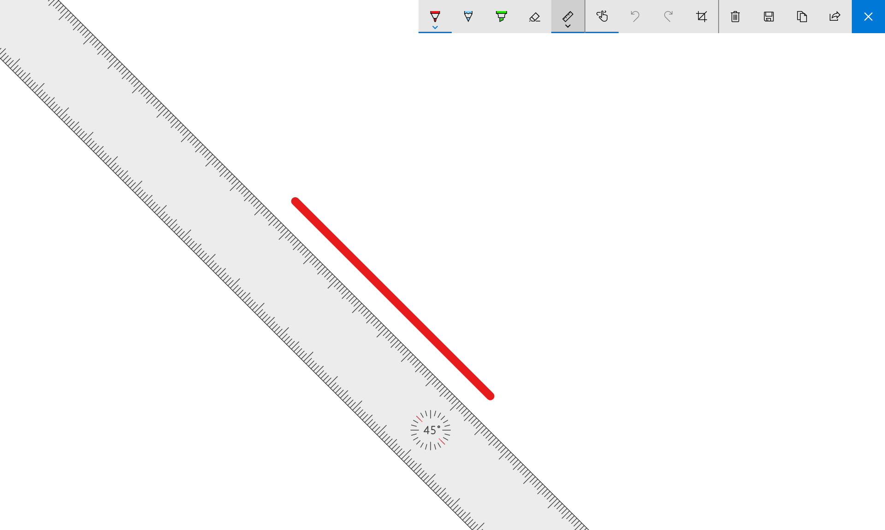
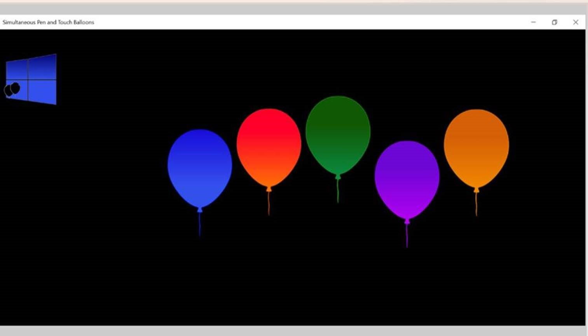
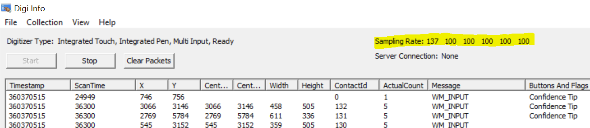

# Simultaneous pen and touch validation

In previous versions of Windows, touch contacts were supressed when pen input was detected within range of the digitizer. Starting in Winodws 1607, devices are able to report simultaneous pen and touch contacts to applications. This topic describes the tools and applications for validating your solution on Windows systems. 

## Simultaneous pen and touch reporting requirements 

Currently, the Windows Hardware Compatibility Program does not contain requirements for simultaneous pen and touch performance. Microsoft instead provides the following recommendations for simultaneous pen and touch performance.

* A device should continue to meet all Windows 10 Pen compatibility requirements when five simultaneous touch contacts are present on the screen.

* A device should continue to meet all Windows 10 touch compatibility requirements when a pen is within reporting range of the screen.

Devices capable of following these recommendations will be able to follow future requirements for pen and touch reporting

## Validating Simultaneous Reporting Support

The first step in validating a Simultaneous Pen and Touch (SPT) system is to ensure the system supports sending touch and pen input simultaneously. Windows supports several ways of verifying this using basic applications. The two recommended methods are detailed below.

### Windows Ink Workspace

Using the Windows Ink Workspace and a pen device, you can validate an SPT system by using the workspace ruler.  

1. Using touch, grab the Ruler and move its location on the screen. 

2. Without lifting the touch contact from the screen, bring the pen into contact with the screen on the canvas, then remove the pen contact. 

3. If the system supports SPT, you should still be able to move the Ruler with the touch contact that is still against the screen. If the system does not support SPT, you will need to remove the touch contact from the screen and tap the Ruler again to move the Ruler.

### Simultaneous pen and touch baloons

You can also use the [Simultaneous Pen and Touch Balloons App](https://www.microsoft.com/store/apps/9nblggh40gjd) developed by Blue Lan to determine if a system supports SPT. The app renders several floating balloons on the screen.

To validate SPT on the system, place a finger on a balloon to stop it, and then tap the stopped balloon with your pen. If balloon is popped by the pen, SPT is supported on the system. If the balloon moves or is not popped, SPT is not supported by the touch device’s firmware.

### Validating pen and touch with the Windows Hardware Lab Kit

To ensure that a device can meet Microsoft's Pen and Touch requirements, Microsoft provides pen and touch tests as part of the Windows Hardware Lab Kit (HLK). Some of these tests can be used to verify that a device meets Microsoft's SPT requirements, as many of the tests now accept both forms of input. The following sections provide detailed guideance on these tests and test proceedures.

> [!NOTE]
> Testing simultaneous pen and touch inputs with the HLK requires HLK build 14971 or greater

## Pre-testing requirements 

In addition to the setup steps required for Touch HLK testing, testing SPT requires you to download and have two additional .reg files:
* [Run_Before_SPT_Testing_And_Restart.reg](http://download.microsoft.com/download/8/1/1/81142741-7429-433D-81FA-FB2FCF2CCB26/Simultaneous Pen and Touch Validation reg files/Run_Before_SPT_Testing_And_Restart.reg)

* [Run_After_SPT_Testing_And_Restart.reg](http://download.microsoft.com/download/8/1/1/81142741-7429-433D-81FA-FB2FCF2CCB26/Simultaneous Pen and Touch Validation reg files/Run_After_SPT_Testing_And_Restart.reg)

Be sure to run the appropriate .reg file before SPT testing to enable the correct testing conditions, and after SPT testing to return the system to its normal state.

## Validating pen requirements

Ensuring a device meets the SPT pen requirements while touch is present on the system can be performed using the Pen HLK. This validation can be performed by running the Pen HLK tests through HLK Studio or [manually](https://docs.microsoft.com/windows-hardware/design/component-guidelines/appendix).

Windows supports SPT testing on the following Pen HLK tests when performed with five fingers in contact with the screen:

* Buffering
* Edge Gutter
* Resolution
* Moving Jitter
* Hover Accuracy
* Hover Range

For more information on these tests, see the [Pen validation guide](https://docs.microsoft.com/windows-hardware/design/component-guidelines/pen-validation-guide)

### Finger placement 

To ensure that finger placement does not interfere with the results of the Pen HLK tests, do not place finger contacts in the green and yellow starting/ending sections on a test iteration, in the path of the pen. 

For all tests, place all finger contacts against the screen before bringing the pen in range of the screen. Fingers can be moved during the test, but do not lift fingers from the screen until the end of an iteration. Additionally, be careful of bringing touch contacts near the buttons used for controlling test iterations.

## Validating touch requirements

Ensuring a device meets the SPT pen requirements while a pen is present on the system can be performed using the Touch HLK. This validation can be performed by running the Touch HLK tests through HLK Studio or [manually](https://docs.microsoft.com/windows-hardware/design/component-guidelines/appendix).

Windows supports SPT testing on the following Touch HLK tests when performed with the pen in contact with the screen:

* 5 Point Minimum
* Buffering
* Latency - Down
* Reporting Rate

For more information on these tests, see the [Touchscreen validation guide](https://msdn.microsoft.com/library/windows/hardware/mt604231)

### Pen Placement

To ensure the pen placement does not interfere with the results of the Touch HLK tests, place the pen as far from the starting/ending sections,  and the path of the fingers as possible. If a finger passes within 12cm of the pen during an iteration, Windows’ built in palm rejection may choose to suppress the contact, causing the iteration to fail. 

To decrease the likelihood of touch contacts being suppressed, you can verify the system's handedness setting. To do this, open the **Settings** menu, and select **Devices**. On the **Devices** list on the left, select **Pen & Windows Ink**. 

If the **Choose which hand you write with** option is set to "Right Hand", placing the pen in the bottom right corner of the screen when a touch target is not in that area will greatly reduce the chance of contacts being suppressed. If it is set to “Left Hand”, placing the pen in the bottom left corner of the screen will do the same. 

For all tests, bring the pen in contact with the screen before bringing any touch contacts against the screen. The pen can be moved during the test, but do not lift the pen from the screen until the end of an iteration. Be careful when bringing the pen near the buttons used for controlling test iterations, as the pen may interact with them.

### Additional testing tools

The test tool [Digiinfo](http://connect.microsoft.com/site1304/Downloads/DownloadDetails.aspx?DownloadID=62352) can be used to view input from touch and pen devices in real time to inspect issues with input reporting. For SPT validation, Digiinfo can be used simply to validate that input is being received from all five fingers when pen is in range of the screen, that the report rate of each touch contact equals/exceeds the screen refresh rate, and that the report rate of the pen is at least 133Hz. 

