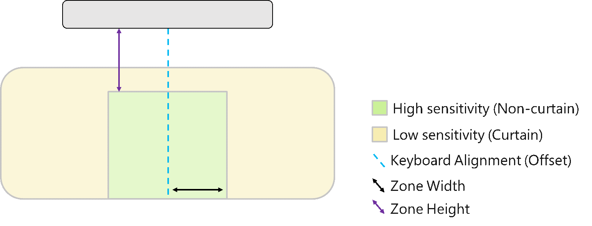

# Precision touchpad tuning

There are several approaches an OEM can take to adjust the default touchpad experience on their Windows-based device. The default values meet the needs of most users, so they should only be adjusted if they don't provide the specific experience that the OEM wants. 

Be aware that serious problems can occur if you modify the registry incorrectly. Therefore, make sure that you follow these steps carefully. For additional protection, back up the registry before you modify it so you can restore the registry if a problem occurs. For more information about how to back up and restore the registry, see [How to back up and restore the registry in Windows](https://support.microsoft.com/en-us/help/322756/how-to-back-up-and-restore-the-registry-in-windowshttps:/support.microsoft.com/en-us/help/322756/how-to-back-up-and-restore-the-registry-in-windows).

## Windows 10 tuning capabilities

Windows 10, version 1607 provides  new registry capabilities for better device tuning. Note that the default values are set to work well with most devices. 

The most common tuning required is shifting the touchpad offset. Keyboard offset registry keys are unchanged from Windows 8.1 and will continue to be used for Windows 10, version 1607. For more information, see [the touchpad tuning guide](https://docs.microsoft.com/en-us/windows-hardware/design/component-guidelines/windows-precision-touchpad-device-integration). All registry keys noted below are stored in: `HKEY_LOCAL_MACHINE\SOFTWARE\Microsoft\Windows\CurrentVersion\PrecisionTouchPad\`

## Non-curtain region sizing

The high sensitivity region can now be completely resized through the registry. This region is intended to stay responsive even during or immediately after keyboard use. 

The width of the region on either side of the center line (Zone Width in the diagram above) is defined as:

*SpacebarOffset* + *AAPNonCurtainBaseWidth*

Note that this means the total width of the region is twice this value. SpacebarOffset is taken into account for the region, since proximity to the keyboard increases risk of palm contact. 

The height of the region is defined in relation to the space bar and stretches to the bottom of the touchpad. Distance to the top of the zone is defined as:

*AAPNonCurtainTop* - *SpaceBarOffset*

Registry keys to control these values are shown in the following table.

| Setting | Name | Type | Default value | Description |
| ---     | ---  | ---  | ---           | --- |
| Non-curtain region width | AAPNonCurtainBaseWidth | DWORD | 1500 | Active region width in himetric |
| Non-curtain region height | AAPNonCurtainTop | DWORD | 1500 | Active region distance from space bar in himetric |
| Vertical offset | SpaceBarOffset | DWORD | 1000 | Offset distance in himetric |

## Super-curtain region sizing

The restricted sensitivity zone is the lowest sensitivity region of the touchpad, and is designed for the region of the touchpad where users would not leave fingers during intentional use. Note these are very small by default and should only be widened for very large devices. 

The top, left, and right zones' sizes are defined independently as a distance from their respective edge. They use the registry keys shown in the following table. 

| Setting | Name | Type | Default value | Description |
| ---     | ---  | ---  | ---           | --- |
| Top super curtain width | SuperCurtainTop | DWORD | 100 | Region distance from edge in himetric |
| Left super curtain width | SuperCurtainLeft | 100 | Region distance from edge in himetric |
| Right super curtain width | SuperCurtainRight | DWORD | 100 | Region distance from edge in himetric |

## Modifying cursor speed

OEMs are capable of changing the default cursor speed by editing the following registry key: `HKEY_CURRENT_USER\SOFTWARE\Microsoft\Windows\CurrentVersion\PrecisionTouchPad\CursorSpeed`

Note that the valid range of values for the key is 0 to 20, with a default value of 10. 

This value is halved to determine the cursor speed notch in the settings page. This lets you add more granular speed options in the future if needed. The default cursor speed is selected according to Fitts' law as the speed that makes target acquisition most efficient. The cursor speed is also changeable by users through the settings page, not just the registry. The registry changes described above only change the default speed for new users.  

## Detecting keyboard mouse collection as a non-mouse

Windows provides a registry setting that lets you exempt specific devices. This can be found in: `HKEY_LOCAL_MACHINE\SOFTWARE\Microsoft\Windows\CurrentVersion\PrecisionTouchPad\IgnoredExternalMice`

Structuring this key is similar to forcing a legacy touchpad to show up ([See Legacy touchpad forced detection](https://docs.microsoft.com/en-us/windows-hardware/design/component-guidelines/windows-legacy-touchpad-forced-detection) ) for more details.  

## Two-finger scrolling speed

Windows currently does not provide a way to modify the Precision Touchpad (PTP) two-finger scrolling speed. 

The **Vertical Scrolling Speed** setting in the classic Control Panel will not impact the PTP two-finger scrolling.