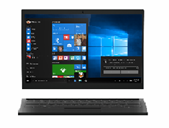
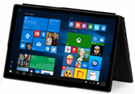

# 2-in-1

A 2-in-1 form factor is an evolution of the traditional notebook, also know as a convertible notebook that comes in two styles: detachable and convertible. Its key feature is the ability to convert from a traditional notebook to a tablet mode. Convertibles are typically more like a notebook that transforms into a tablet. Detachables are typically more like a tablet with a high quality keyboard base or attachment. Windows 10 for desktop editions (Home, Pro, Enterprise, and Education) introduces a new feature called Continuum that takes advantage of a 2-in-1s unique design. The feature will adjust the user experience based on what mode the device is in. The following table describes some recommended hardware configurations.

<table>
<tbody valign="top">
<tr>
<td colspan="1">&nbsp;</td>
<td>

</td>
<td colspan="2" style="text-align: center;">

</td>
</tr>
<tr>
<td colspan="1" bgcolor="EEEEEE">&nbsp;</td>
<td style="width:30%">Entry 2-in-1  Detachable
</td>
<td style="width:30%">Mainstream 2-in-1
</td>
<td style="width:30%">Premium 2-in-1
</td>
</tr>
<tr>
<td colspan="1" bgcolor="EEEEEE">
Key Features
</td>
<td>

[Cortana](../device-experiences/cortana.md)

[Continuum](../device-experiences/continuum.md)

[Windows&nbsp;Hello](../device-experiences/windows-hello.md)

[Wired&nbsp;and&nbsp;Wireless Docking&nbsp;and&nbsp;Casting (USB-C;&nbsp;Miracast)](../device-experiences/docking.md)

[Inking/Pen&nbsp;Support](../component-guidelines/pen-devices.md)

</td>
<td>

[Cortana](../device-experiences/cortana.md)

[Continuum](../device-experiences/continuum.md)

[Windows&nbsp;Hello](../device-experiences/windows-hello.md)

[Wired&nbsp;and&nbsp;Wireless Docking&nbsp;and&nbsp;Casting (USB-C;&nbsp;Miracast)](../device-experiences/docking.md)

[Inking/Pen&nbsp;Support](../component-guidelines/pen-devices.md)

</td>
<td>

[Cortana](../device-experiences/cortana.md)

[Continuum](../device-experiences/continuum.md)

[Windows&nbsp;Hello](../device-experiences/windows-hello.md)

[Wired&nbsp;and&nbsp;Wireless Docking&nbsp;and&nbsp;Casting (USB-C;&nbsp;Miracast)](../device-experiences/docking.md)

[Inking/Pen&nbsp;Support](../component-guidelines/pen-devices.md)

[Long&nbsp;battery&nbsp;life (12+&nbsp;hours)](../component-guidelines/battery.md)

[Precision&nbsp;Touchpad](../component-guidelines/precision-touchpad-devices.md)

</td>
</tr>
<tr>
<td colspan="1" bgcolor="EEEEEE">Operating System</td>
<td>Windows&nbsp;10  for desktop editions</td>
<td>Windows&nbsp;10  for desktop editions</td>
<td>Windows&nbsp;10  for desktop editions</td>
</tr>
<tr>
<td colspan="4" bgcolor="EEEEEE">[Recommended Components](../component-guidelines/components.md)</td>
</tr>
<tr>
<td bgcolor="EEEEEE">
CPU
</td>
<td>
Mobile to mid-tier x86
</td>
<td>
Mid-range x86
</td>
<td>
Premium x86
</td>
</tr>
<tr>
<td bgcolor="EEEEEE">
RAM/Storage
</td>
<td>
2&nbsp;GB+&nbsp;/ 32&nbsp;GB+  or 320&nbsp;GB+ HDD
</td>
<td>
4&nbsp;GB+&nbsp;/ 32&nbsp;GB+  with SD slot
</td>
<td>
4&ndash;16&nbsp;GB&nbsp;/ 64&nbsp;GB&ndash;1&nbsp;TB SSD
</td>
</tr>
<tr>
<td bgcolor="EEEEEE">
Display
</td>
<td>
10.1&rdquo;&ndash;13.3&rdquo;  HD+ Touch
</td>
<td>
10.1&ndash;12.5&rdquo;  FHD+
</td>
<td>
11.6&rdquo;&ndash;14&rdquo;  FHD-4K / Touch
</td>
</tr>
<tr>
<td bgcolor="EEEEEE">
Dimensions
</td>
<td>
&lt;&nbsp;10mm&nbsp;&amp; &lt;&nbsp;.6kg  (Tablet)
</td>
<td>
&lt;&nbsp;18mm&nbsp;&amp; &lt;&nbsp;1.36kgs  w/ keyboard
</td>
<td>
&lt;&nbsp;16mm&nbsp;&amp; &lt;&nbsp;1.36kg  (combined w/ keyboard)
</td>
</tr>
<tr>
<td bgcolor="EEEEEE">
Battery
</td>
<td>
8+&nbsp;hours
</td>
<td>
8+&nbsp;hours
</td>
<td>
12+&nbsp;hours
</td>
</tr>
<tr>
<td bgcolor="EEEEEE">
Connectivity
</td>
<td>

802.11ac

1 USB 3.0

BT LE

HDMI

LTE option

</td>
<td>

802.11ac

USB 3.0

BT LE

HDMI

LTE option

NFC

</td>
<td>

802.11ac

2+ USB 3.<i>x</i>

BT LE

LTE option

</style>
</td>
</tr>
<tr>
<td bgcolor="EEEEEE">
Audio/Video
</td>
<td>

Front &amp; rear cameras

Speakers

Headphones

Full-array mics

</td>
<td>

Front &amp; rear cameras

Speakers

Headphones

Full-array mics

</td>
<td>

Stereo Speaker

HD Webcam

Full-array mics

</td>
</tr>
</tbody>
</table>

